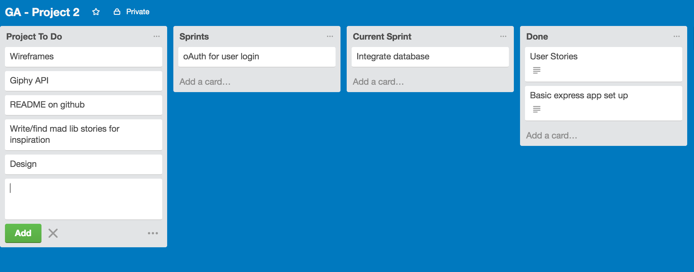
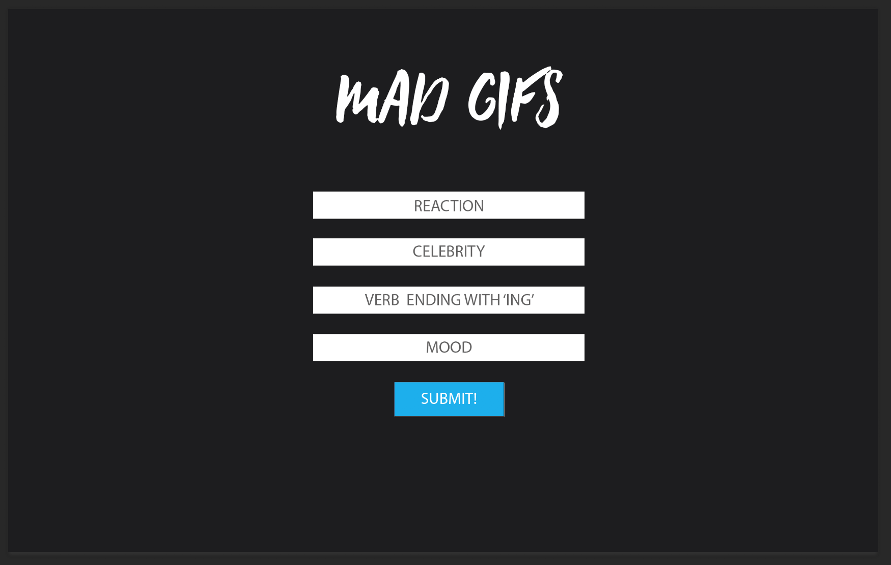
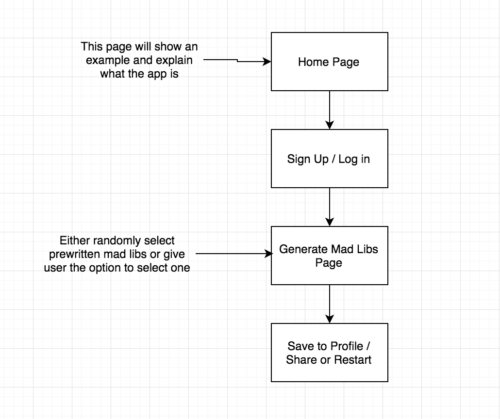

# Madgifs
## Fun twist on the classic Mad Lib with GIF's!

## User Story
As a fan of hilarious GIFs I want to create mad lib stories with GIFs so I can laugh, share with my friends, or save to my profile page.

# Technical Requirements
* Have at least 2 models
* Include sign up/log in functionality
* Incorporate at least one API
* Have complete RESTful routes
* Utilize an ORM to create a database table structure
* Use semantic markup for HTML and CSS (adhere to best practices)

# Project Progress: 

## Trello Board
### Initial Trello Setup

### Initial Design Mock Up

### Userflow

### Sample Story

# Technologies Used
* Node.js
* Express.js
* PostgresSQL
* Giphy API
* Heroku
* Git / GitHub
* Trello

# Approach Taken
I always enjoyed writing mad libs, and can spend hours searching for the perfect GIF. I wanted to create an app that combined these two.
* First started with user sign up/login 
	* Used Bcrypt to hash the password
	* Used Sessions to keep track of user
* Next worked on connecting with Giphy API and displaying one GIF
	* Connected using the Giphy-API NPM package
	* Used GET method with a search form
* Increased the API calls to four searches from one call
	* Used Async to manage multiple API calls without crashing
* Interjected results into story
	* Used the URL's returned from the Giphy API to interject into the mad lib story

# Issues
* Multiple API calls with one GET request - Used Async to solve this.
* Saving favorite GIFs to profile page.
* Connecting two models to link favorites to the specific user.

# Fun Stuff
* Writing the mad lib story
* Working with the Giphy API

# Unsolved Problem
* Instead of just saving all the GIFs to a favorite page, I would like to save the story url that can be reloaded when clicked on

# Next Steps
* Add more stories
* Randomly select which story is displayed
* Share to Facebook
